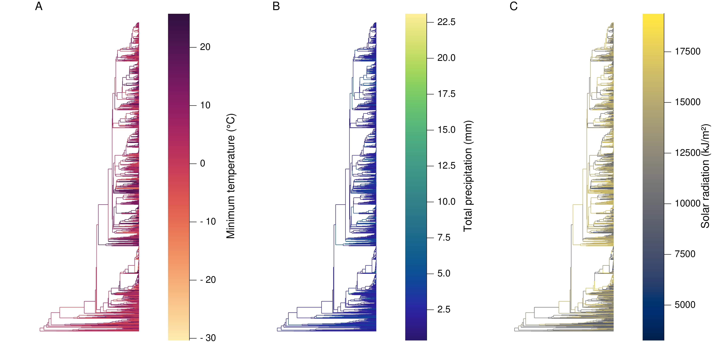

# ClimatePref

## Summary

**ClimatePref** is a [Julia](http://www.julialang.org) package that provides functionality for extracting and analysing plant climate preferences from multiple sources:

- Global Biodiversity Information Facility ([GBIF](https://www.gbif.org))
- European Centre for Medium-Range Weather Forecasts ([ECMWF](https://www.ecmwf.int))
- [WorldClim](https://worldclim.org)
- World Flora Online ([WFO](https://www.worldfloraonline.org))
- Botanic Gardens Conservation International ([BGCI](https://www.bgci.org))
- Enhanced Vegetation Index from [MODIS](https://modis.gsfc.nasa.gov)
- Mega-phylogeny of Angiosperms from [Qian *et al.* 2016](https://doi.org/10.1093/jpe/rtv047)

Version 1 of the bioclimatic envelopes extracted for each species from this project can be found [here](https://catalogue.ceh.ac.uk/documents/ca339c86-3674-4030-b891-35326e71141e). Current version is [here](https://github.com/NaturalHistoryMuseum/plant-traits). This code only runs with Julia version 1.6.x.
